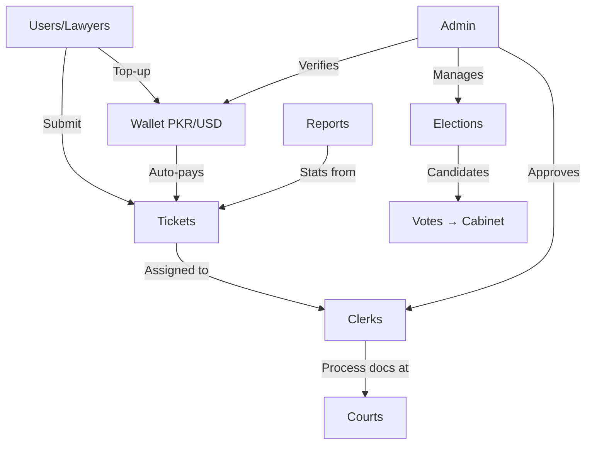
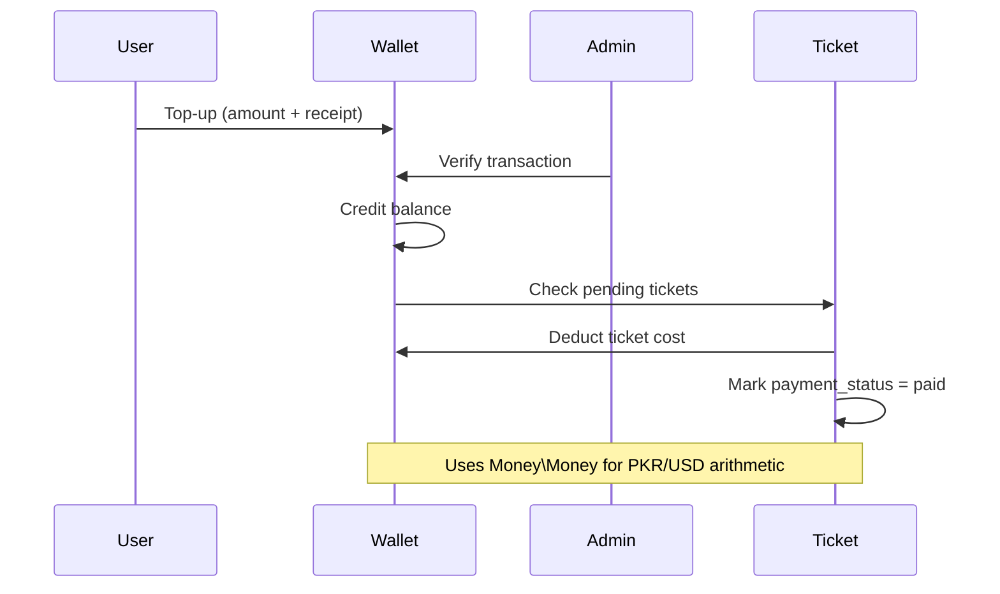

# Wusuq — Codebase Walkthrough

> **Stack**: Laravel 10 (PHP 8.1+), Blade views, Spatie (roles/media), Money\Money, MySQL  
> **Domain**: Legal services management for Pakistan (courts, clerks, bar associations)

---

## Architecture Overview



---

## Domain Entities & Relationships

| Entity | Key Fields | Relationships |
|---|---|---|
| **User** | name, email, type ([lawyer](file:///Users/asad/Projects/wusuq-main/app/Models/User.php#99-102)), currency, is_deleted | → UserDetails, LawyerDetail, Clerk, Wallet, Tickets, ElectionCandidate |
| **Ticket** | ticket_number, ticket_status, is_approved, is_completed, payment_status, delivery_mode | → Service, Court, TicketPayment, TicketMember, Activities, TicketLogs, District, Station, CaseType |
| **Service** | name, type | → Tickets, Courts |
| **Clerk** | user_id, is_available, is_approved | → User, many Tickets |
| **Wallet** | user_id, balance currency | → User, WalletTransaction |
| **Election** | name, year, tenure, province_id, status | → ElectionCity, ElectionPosition, ElectionCandidate |

---

## Module Breakdown

### 1. Ticket Lifecycle ([TicketController](file:///Users/asad/Projects/wusuq-main/app/Http/Controllers/TicketController.php))

The core workflow: **Create → Approve → Assign Clerk → Process → Complete → Archive**

- **Views**: Active, Requested, Assigned, Completed, Archived — each with search/pagination
- **Ticket creation** ([ServicesController](file:///Users/asad/Projects/wusuq-main/app/Http/Controllers/ServicesController.php)): User picks judicial/non-judicial service → selects court/city → enters case details → attached documents (polymorphic [TicketDocument](file:///Users/asad/Projects/wusuq-main/app/Http/Controllers/TicketController.php#1034-1048))
- **Payment calculation** ([Ticket model](file:///Users/asad/Projects/wusuq-main/app/Models/Ticket.php#L143-L216)): [totalPayments()](file:///Users/asad/Projects/wusuq-main/app/Models/Ticket.php#143-148), [totalPaymentsAfterDiscount()](file:///Users/asad/Projects/wusuq-main/app/Models/Ticket.php#149-156), [totalClerkCost()](file:///Users/asad/Projects/wusuq-main/app/Models/Ticket.php#165-170), [costPayments()](file:///Users/asad/Projects/wusuq-main/app/Models/Ticket.php#183-188) — sums: case_payment + additional_service_cost + delivery + printing + additional + attested + non_attested charges, minus discount
- **Clerk assignment**: Admin assigns via [assignMembers()](file:///Users/asad/Projects/wusuq-main/app/Http/Controllers/TicketController.php#524-562) — creates `TicketMember` linking ticket↔clerk, updates `is_assigned`, logs activity
- **Status updates**: [updateTicket()](file:///Users/asad/Projects/wusuq-main/app/Http/Controllers/TicketController.php#786-818) / [updateStatus()](file:///Users/asad/Projects/wusuq-main/app/Http/Controllers/TicketController.php#1064-1123) — handles status transitions, file uploads, notifications, logging
- **Bulk actions**: Mass approve/reject/complete
- **Invoice**: [generateInvoice()](file:///Users/asad/Projects/wusuq-main/app/Http/Controllers/TicketController.php#1391-1397) renders PDF, [sendInvoice()](file:///Users/asad/Projects/wusuq-main/app/Http/Controllers/TicketController.php#667-711) emails it, [forceDownload()](file:///Users/asad/Projects/wusuq-main/app/Http/Controllers/TicketController.php#505-523) downloads

### 2. Wallet & Payments ([WalletController](file:///Users/asad/Projects/wusuq-main/app/Http/Controllers/WalletController.php))

- **Top-up flow**: User creates wallet transaction (amount + receipt upload) → Admin verifies → Balance credited
- **Auto-payment**: On wallet verification, system checks for user's pending tickets and auto-deducts via `Money\Money` arithmetic (PKR/USD)
- **Currency**: Each user has a `currency` field; `Money\Money` objects with `Money\Currency` used for safe arithmetic
- **Ledger**: [WalletTransaction](file:///Users/asad/Projects/wusuq-main/app/Http/Controllers/TicketController.php#1857-1885) tracks all movements; [transactionsHistory()](file:///Users/asad/Projects/wusuq-main/app/Http/Controllers/WalletController.php#201-222) and [invoiceHistory()](file:///Users/asad/Projects/wusuq-main/app/Http/Controllers/WalletController.php#223-228) for reporting

### 3. Clerk Management ([ClerkController](file:///Users/asad/Projects/wusuq-main/app/Http/Controllers/ClerkController.php))

- **Admin CRUD**: Create clerk users with phone (+92 formatting), Spatie roles, media uploads
- **Approval workflow**: Clerks upload payment receipts → [sendAdminApprovalRequests()](file:///Users/asad/Projects/wusuq-main/app/Http/Controllers/ClerkController.php#381-513) → Admin reviews via [verifyClerkRecipets()](file:///Users/asad/Projects/wusuq-main/app/Http/Controllers/ClerkController.php#513-542) (approve/reject with reason)
- **Clerk costs**: Separate `ClerkCostController` for managing per-service clerk rates

### 4. Elections ([ElectionController](file:///Users/asad/Projects/wusuq-main/app/Http/Controllers/ElectionController.php))

Bar association election system:

- **Election CRUD**: Name, year, tenure, province, cities (excluding Karachi subdivisions), positions
- **Candidate management**: Creates [User](file:///Users/asad/Projects/wusuq-main/app/Models/User.php#19-142) (type=lawyer) + `UserDetails` + `LawyerDetail` + [ElectionCandidate](file:///Users/asad/Projects/wusuq-main/app/Http/Controllers/ElectionController.php#475-493) + [ElectionHistory](file:///Users/asad/Projects/wusuq-main/app/Http/Controllers/ElectionController.php#687-692) — all in one transaction
- **Voting**: Simple `Vote` model linked to [ElectionCandidate](file:///Users/asad/Projects/wusuq-main/app/Http/Controllers/ElectionController.php#475-493)
- **Finalization**: [finalizeElection()](file:///Users/asad/Projects/wusuq-main/app/Http/Controllers/ElectionController.php#693-726) counts votes → creates [ElectionHistory](file:///Users/asad/Projects/wusuq-main/app/Http/Controllers/ElectionController.php#687-692) (Winner/Runner-Up) → populates [Cabinet](file:///Users/asad/Projects/wusuq-main/app/Http/Controllers/ElectionController.php#726-731) → deactivates election
- **Public pages**: Election listing, candidate profiles, search/filter by city/position/name

### 5. Reports ([ReportController](file:///Users/asad/Projects/wusuq-main/app/Http/Controllers/ReportController.php))

- **User logs**: Per-user activity history with pagination
- **Ticket activity logs**: Per-ticket action timeline
- **Financial stats**: Total ticket value, total clerk costs, profit calculation, date-range filtering
- **Turnaround**: Created-to-completed duration analysis
- **Breakdown views**: Cases by service, by city, by status

### 6. Finance ([FinanceController](file:///Users/asad/Projects/wusuq-main/app/Http/Controllers/FinanceController.php))

- Lists all tickets with payment details alongside clerk cost data for financial overview

---

## Key Patterns

| Pattern | Implementation |
|---|---|
| **Auth/Roles** | Spatie Permission (`HasRoles`), `role:super-admin` middleware for admin routes |
| **Media** | Spatie MediaLibrary — profile images, receipts, ticket documents |
| **Soft delete** | Custom `is_deleted` flag (not Laravel's `SoftDeletes`) |
| **Dependent delete** | Custom `DependentDeleteTrait` via [BaseModel](file:///Users/asad/Projects/wusuq-main/app/Models/BaseModel.php#9-47) — cascades to related models |
| **Model hooks** | [BaseModel](file:///Users/asad/Projects/wusuq-main/app/Models/BaseModel.php#9-47) fires `beforeSave/afterSave/beforeCreate/afterCreate` lifecycle callbacks |
| **Phone formatting** | `GeneralFunctionTrait::formatPhoneNumber()` — Pakistan +92 format |
| **Impersonation** | Lab404/Impersonate — admin can log in as any user |
| **2FA** | OTP verification flow via `OtpVerficationController` |
| **Nested attributes** | `NestedAttributesModel` base class enables accepts_nested_attributes Rails-style patterns |

---

## Route Map (Abridged)

| Area | Key Routes |
|---|---|
| **Public** | `GET /elections`, `GET /election/Candidates/{id}`, `POST /vote`, `GET /thankyou` |
| **Auth required** | All ticket, wallet, report, finance, profile, clerk, document routes |
| **Admin only** (`role:super-admin`) | User/clerk CRUD, wallet verification, clerk receipt verification, ticket editing, service costs, member assignment |

---

## Data Flow: Ticket Payment



---

## Notable Models Hierarchy

```
Model (Eloquent)
├── User (Authenticatable + HasMedia + HasRoles + Impersonate)
├── Service
└── NestedAttributesModel
    └── BaseModel (DependentDeleteTrait + lifecycle hooks)
        └── Ticket (HasFactory + eager-loads 8 relations)
```
