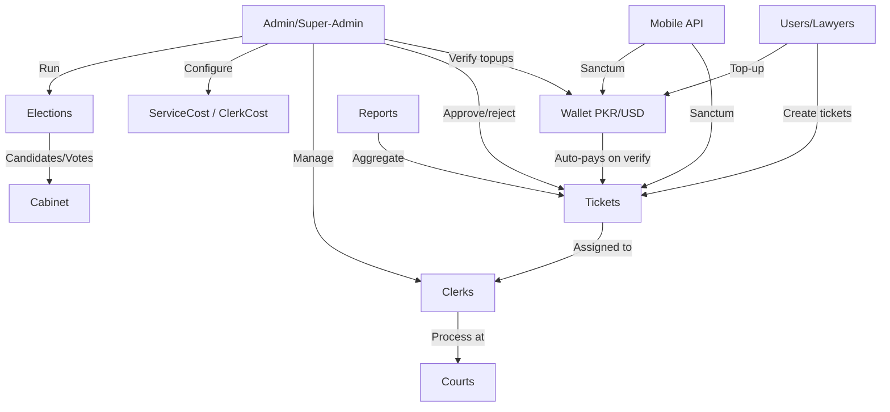
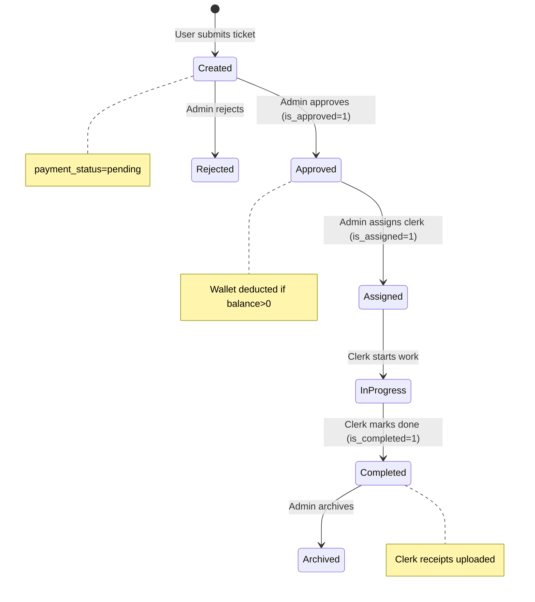

# Wusuq — Comprehensive Codebase Specification

> **Stack**: Laravel 10 (PHP 8.1+), Blade/Livewire views, MySQL, Sanctum API auth, Spatie (roles/media/settings), Money\Money  
> **Domain**: Legal document services marketplace for Pakistan — lawyers submit requests ("tickets"), admin assigns clerks who process documents at courts, payments via prepaid wallet (PKR/USD)

---

## 1. Architecture Overview



### Model Hierarchy

```
Eloquent\Model
├── User (Authenticatable + HasMedia + HasRoles + Impersonate + MustVerifyNewEmail)
├── Service, Court, Province, District, Tehsil, City, Division
├── Wallet, Transaction, ExchangeRate
├── Election, ElectionCandidate, ElectionCity, ElectionPosition, ElectionHistory, Vote, Cabinet
├── Notification, TicketPayment, PaymentRecord, PaymentHistories, InvoiceHistory
├── ServiceCost, ClerkCost (both use Payment trait)
├── TicketDocument (polymorphic)
└── NestedAttributesModel (HasNestedAttributesTrait)
    └── BaseModel (DependentDeleteTrait + lifecycle hooks)
        └── Ticket (eager-loads 8 relations, 50+ fillable fields)
```

---

## 2. Roles & Access Matrix

**Roles** (Spatie Permission, guard: `['sanctum', 'web']`):

| Role | Key Capabilities |
|---|---|
| `super-admin` | Full CRUD on all entities, verify wallets, approve clerks, manage elections, impersonate users |
| [admin](file:///Users/asad/Projects/wusuq-main/app/Models/Ticket.php#189-193) | Ticket management, clerk management, report viewing |
| `representative` | Create/view own tickets, wallet top-up |
| [user](file:///Users/asad/Projects/wusuq-main/app/Models/Wallet.php#18-22) (lawyer) | Create/view own tickets, wallet top-up, vote in elections |
| [clerk](file:///Users/asad/Projects/wusuq-main/app/Models/User.php#103-106) | View assigned tickets, upload receipts, update ticket status |

**Middleware**: `role:super-admin` guards admin web routes. API uses `auth:sanctum`.

---

## 3. Domain Models — Complete Field Inventory

### Ticket (extends BaseModel)
| Field | Purpose |
|---|---|
| `user_id`, `service_id`, `court_id` | Foreign keys |
| `court_city`, `service_category` | Denormalized lookups |
| `case_no`, `case_title`, `case_status`, `case_date` | Case metadata |
| `batch_no` | Grouping multiple tickets |
| `judge_name`, `judge_designation` | Judge info |
| `required_documents`, `notes` | Free text |
| `address`, `delivery_mode` | Delivery info |
| `sets`, `set_type` | Number/type of document copies |
| `ticket_number` | Auto-generated unique identifier |
| `ticket_status` | Workflow state (see state machine below) |
| `is_approved`, `is_completed`, `is_assigned`, `is_address`, `is_phone` | Boolean flags |
| `payment_status` | `pending` / `paid` |
| `office_name`, [city](file:///Users/asad/Projects/wusuq-main/app/Http/Controllers/TicketController.php#1306-1328), `city_type` | Location info |
| `doc_no`, `year`, `offence`, `fir_no` | Non-judicial/police document fields |
| `district_id`, `station_id`, `case_type` | Police station lookup |
| `phone` | Contact number |
| `case_future_date`, `reminder_status` | Future-dated reminders |

**Eager loads**: [service](file:///Users/asad/Projects/wusuq-main/app/Models/Ticket.php#83-87), [courts](file:///Users/asad/Projects/wusuq-main/app/Models/Ticket.php#98-102), [payments](file:///Users/asad/Projects/wusuq-main/app/Models/Ticket.php#103-107), [members](file:///Users/asad/Projects/wusuq-main/app/Models/Ticket.php#108-112), [district](file:///Users/asad/Projects/wusuq-main/app/Models/Ticket.php#128-132), [station](file:///Users/asad/Projects/wusuq-main/app/Models/Ticket.php#133-137), [document](file:///Users/asad/Projects/wusuq-main/app/Models/Transaction.php#34-37), [users](file:///Users/asad/Projects/wusuq-main/app/Models/Ticket.php#93-97), [caseType](file:///Users/asad/Projects/wusuq-main/app/Models/Ticket.php#138-142)

**Dependent deletes** (cascaded in transaction): [document](file:///Users/asad/Projects/wusuq-main/app/Models/Transaction.php#34-37), [members](file:///Users/asad/Projects/wusuq-main/app/Models/Ticket.php#108-112), [payments](file:///Users/asad/Projects/wusuq-main/app/Models/Ticket.php#103-107), [activities](file:///Users/asad/Projects/wusuq-main/app/Models/Ticket.php#113-117), [ticketLogs](file:///Users/asad/Projects/wusuq-main/app/Models/Ticket.php#118-122), [paymentHistories](file:///Users/asad/Projects/wusuq-main/app/Models/Ticket.php#123-127)

### TicketPayment (extends Model, no timestamps)
| Field | Purpose |
|---|---|
| `ticket_id` | Owner ticket |
| `case_payment` | Base service cost (PKR) |
| `additional_service_cost` | Extra service fees |
| `delivery_charges`, `printing_charges`, `additional_charges` | Line-item fees |
| `attested_charges`, `non_attested_charges` | Attestation fees |
| `discount_price` | Discount amount |
| `clerk_cost` | Cost owed to clerk |
| `cost_per_page`, `no_of_pages` | Page-based pricing |
| `payment_mode` | Payment method |
| `amount_paid`, `total_amount` | Running totals |
| `approval_status` | `verified` / `admin_approved` / `pending` |
| `created_by` | Who created the payment |

### Wallet
| Field | Purpose |
|---|---|
| `user_id` | Owner user |
| `balance` | Current balance (can go negative) |
| `pending_balance` | Unverified topup amount |
| `paid_balance` | Confirmed paid amount |

### Transaction
| Field | Purpose |
|---|---|
| `wallet_id`, `uploaded_by_id` | Foreign keys |
| `type` | Transaction type |
| `payment_mode` | Method (bank transfer, easypaisa, etc.) |
| `amount`, `amount_in_usd`, `currency` | Amount + currency |
| `is_verify`, `verified_by` | Verification status |
| `ticket_id` | Associated ticket (if deduction) |

### ServiceCost / ClerkCost (identical schema, both use [Payment](file:///Users/asad/Projects/wusuq-main/app/Models/Ticket.php#183-188) trait)
| Field | Purpose |
|---|---|
| `service_category`, `case_type`, `service_id` | Service lookup keys |
| `year_from`, `year_to` | Year range for pricing |
| `province_id` | Province-specific pricing |
| `type` | Cost type discriminator |
| [cost](file:///Users/asad/Projects/wusuq-main/app/Models/Ticket.php#183-188) | Amount in PKR |

### ExchangeRate
| Field | Purpose |
|---|---|
| [date](file:///Users/asad/Projects/wusuq-main/app/Http/Controllers/FinanceController.php#86-97) | Rate date |
| `from_currency`, `to_currency` | Currency pair (always PKR→USD) |
| [rate](file:///Users/asad/Projects/wusuq-main/app/Http/Controllers/TicketController.php#1391-1397) | Exchange rate for that day |

### PaymentHistories
Audit trail for cost changes: `ticket_id`, `field_updated`, `change_date`, `old_amount`, `new_amount`, `status`, `performed_by`

### Notification
| Field | Purpose |
|---|---|
| `sender_id`, `recipient_id` | User references |
| `type` | Notification category |
| `notification_attributes` | JSON blob containing `ticket_id` and/or `wallet_id` |
| `is_read` | Read status |

---

## 4. Key Traits & Patterns

### Payment Trait ([Payment.php](file:///Users/asad/Projects/wusuq-main/app/Traits/Payment.php))
Used by [ServiceCost](file:///Users/asad/Projects/wusuq-main/app/Models/ServiceCost.php#9-27) and [ClerkCost](file:///Users/asad/Projects/wusuq-main/app/Models/ClerkCost.php#9-27). Core method: `getServicesCostByProvince($service_id, $province_id, $year, $case_type)`

**Algorithm**:
1. Resolve province from [Court](file:///Users/asad/Projects/wusuq-main/app/Http/Controllers/ServicesController.php#120-146) → [City](file:///Users/asad/Projects/wusuq-main/app/Http/Controllers/ReportController.php#260-281) → [Province](file:///Users/asad/Projects/wusuq-main/app/Traits/Payment.php#63-76) chain
2. Query costs matching `service_id` + `province_id` where `year_from <= year <= year_to`
3. Filter by `case_type` if provided
4. Convert PKR→USD if user's `currency` = [USD](file:///Users/asad/Projects/wusuq-main/app/Helpers/helpers.php#32-45) using today's [ExchangeRate](file:///Users/asad/Projects/wusuq-main/app/Models/ExchangeRate.php#8-19)
5. Returns cost or 0

### DependentDeleteTrait ([DependentDeleteTrait.php](file:///Users/asad/Projects/wusuq-main/app/Traits/DependentDeleteTrait.php))
Wraps deletes in `DB::beginTransaction()`, iterates `$dependent_delete` array, handles `HasOne/MorphOne/HasMany/MorphMany`, rolls back on failure.

### BaseModel → NestedAttributesModel
- [NestedAttributesModel](file:///Users/asad/Projects/wusuq-main/app/Models/NestedAttributesModel.php#8-21): enables Rails-style `accepts_nested_attributes` for related models
- [BaseModel](file:///Users/asad/Projects/wusuq-main/app/Models/BaseModel.php#9-47): adds `beforeSave/afterSave/beforeCreate/afterCreate` lifecycle hooks

### GeneralFunctionTrait
Phone formatting (`+92` Pakistan format), shared across controllers

---

## 5. Ticket Lifecycle State Machine



**Key status fields**: `ticket_status` (string), `is_approved` (bool), `is_completed` (bool), `is_assigned` (bool), `payment_status` (pending/paid)

---

## 6. Wallet & Payment Flow

### Top-up Flow
1. User calls `WalletController@store` with amount + receipt upload
2. Creates [Wallet](file:///Users/asad/Projects/wusuq-main/app/Models/Wallet.php#8-28) (if first time) + [Transaction](file:///Users/asad/Projects/wusuq-main/app/Models/Transaction.php#8-43) (is_verify=0)
3. Stores receipt as [TicketDocument](file:///Users/asad/Projects/wusuq-main/app/Http/Controllers/TicketController.php#1034-1048) (type=`wallet_topup`)
4. Admin sees pending transactions → calls [verifyWalletTransaction](file:///Users/asad/Projects/wusuq-main/app/Http/Controllers/WalletController.php#179-200)
5. On verify: `Transaction.is_verify=1`, `Wallet.balance += amount`
6. System calls [clearPendingTickets($user_id)](file:///Users/asad/Projects/wusuq-main/app/Http/Controllers/WalletController.php#238-366) → auto-deducts for pending tickets

### clearPendingTickets Logic
For each of user's tickets where `ticket_status != 'cancelled'`:
- If `approval_status = 'verified'`: deducts [totalPaymentsAfterDiscount()](file:///Users/asad/Projects/wusuq-main/app/Models/Ticket.php#149-156) from wallet
- If `approval_status = 'admin_approved'`: deducts [totalPaymentsBeforeCasePayment()](file:///Users/asad/Projects/wusuq-main/app/Models/Ticket.php#210-217) from wallet
- If `approval_status = 'pending'`: deducts [totalPaymentsBeforeCasePayment()](file:///Users/asad/Projects/wusuq-main/app/Models/Ticket.php#210-217) from wallet
- Uses `Money\Money` for arithmetic, creates [Transaction](file:///Users/asad/Projects/wusuq-main/app/Models/Transaction.php#8-43) per deduction
- **Wallet balance CAN go negative** (no guard)

### Cost Calculation Helpers (helpers.php)
- [convertPKRtoUSDWithDate($amount, $date)](file:///Users/asad/Projects/wusuq-main/app/Helpers/helpers.php#32-45) — uses daily [ExchangeRate](file:///Users/asad/Projects/wusuq-main/app/Models/ExchangeRate.php#8-19) record
- [convertUSDtoPKRWithDate($amount, $date)](file:///Users/asad/Projects/wusuq-main/app/Helpers/helpers.php#46-62) — inverse of above
- [calculateTotalAmountInUSD($ticket)](file:///Users/asad/Projects/wusuq-main/app/Helpers/helpers.php#63-86) — sums all 7 charge fields × rate, minus discount
- [calculateTotalAmountInPKR($ticket)](file:///Users/asad/Projects/wusuq-main/app/Helpers/helpers.php#87-108) — converts `case_payment` to USD, keeps other fields in PKR, subtracts discount

### Total Payment Formulas (Ticket model)
- [totalPayments()](file:///Users/asad/Projects/wusuq-main/app/Models/Ticket.php#143-148) = `case_payment + additional_service_cost + delivery + printing + additional + attested + non_attested`
- [totalPaymentsAfterDiscount()](file:///Users/asad/Projects/wusuq-main/app/Models/Ticket.php#149-156) = above − `discount_price`
- [totalClerkCost()](file:///Users/asad/Projects/wusuq-main/app/Models/Ticket.php#165-170) = `clerk_cost` only
- [totalClerkCostbyServices()](file:///Users/asad/Projects/wusuq-main/app/Models/Ticket.php#177-182) = `clerk_cost + delivery + printing + additional + attested + non_attested`
- [costPayments()](file:///Users/asad/Projects/wusuq-main/app/Models/Ticket.php#183-188) = `case_payment + additional_service_cost` only
- [totalPaymentsBeforeCasePayment()](file:///Users/asad/Projects/wusuq-main/app/Models/Ticket.php#210-217) = all charges except `case_payment`, minus discount

---

## 7. Controller Inventory

| Controller | Lines | Key Methods |
|---|---|---|
| [TicketController](file:///Users/asad/Projects/wusuq-main/app/Http/Controllers/TicketController.php) | ~750 | [activeTickets](file:///Users/asad/Projects/wusuq-main/app/Http/Controllers/TicketController.php#208-233), `requestedTickets`, [assignedTickets](file:///Users/asad/Projects/wusuq-main/app/Http/Controllers/TicketController.php#242-249), [completedTickets](file:///Users/asad/Projects/wusuq-main/app/Http/Controllers/TicketController.php#156-181), `archivedTickets`, `approveTickets`, [updateTicket](file:///Users/asad/Projects/wusuq-main/app/Http/Controllers/TicketController.php#786-818), [updateStatus](file:///Users/asad/Projects/wusuq-main/app/Http/Controllers/TicketController.php#1064-1123), [assignMembers](file:///Users/asad/Projects/wusuq-main/app/Http/Controllers/TicketController.php#524-562), [generateInvoice](file:///Users/asad/Projects/wusuq-main/app/Http/Controllers/TicketController.php#1391-1397), [sendInvoice](file:///Users/asad/Projects/wusuq-main/app/Http/Controllers/TicketController.php#667-711) |
| [WalletController](file:///Users/asad/Projects/wusuq-main/app/Http/Controllers/WalletController.php) | 395 | [store](file:///Users/asad/Projects/wusuq-main/app/Http/Controllers/FinanceController.php#53-63), [verifyWalletTransaction](file:///Users/asad/Projects/wusuq-main/app/Http/Controllers/WalletController.php#179-200), [clearPendingTickets](file:///Users/asad/Projects/wusuq-main/app/Http/Controllers/WalletController.php#238-366), [transactionsHistory](file:///Users/asad/Projects/wusuq-main/app/Http/Controllers/WalletController.php#201-222), [invoiceHistory](file:///Users/asad/Projects/wusuq-main/app/Http/Controllers/WalletController.php#223-228) |
| [ElectionController](file:///Users/asad/Projects/wusuq-main/app/Http/Controllers/ElectionController.php) | ~600 | [store](file:///Users/asad/Projects/wusuq-main/app/Http/Controllers/FinanceController.php#53-63), [addCandidates](file:///Users/asad/Projects/wusuq-main/app/Http/Controllers/ElectionController.php#304-309), [candidateElections](file:///Users/asad/Projects/wusuq-main/app/Models/User.php#131-135), [vote](file:///Users/asad/Projects/wusuq-main/app/Http/Controllers/ElectionController.php#451-467), [finalizeElection](file:///Users/asad/Projects/wusuq-main/app/Http/Controllers/ElectionController.php#693-726), `deleteCandidate` |
| [ClerkController](file:///Users/asad/Projects/wusuq-main/app/Http/Controllers/ClerkController.php) | ~400 | [index](file:///Users/asad/Projects/wusuq-main/app/Http/Controllers/ElectionController.php#29-39), [store](file:///Users/asad/Projects/wusuq-main/app/Http/Controllers/FinanceController.php#53-63), [update](file:///Users/asad/Projects/wusuq-main/app/Http/Controllers/FinanceController.php#86-97), [sendAdminApprovalRequests](file:///Users/asad/Projects/wusuq-main/app/Http/Controllers/ClerkController.php#381-513), [verifyClerkRecipets](file:///Users/asad/Projects/wusuq-main/app/Http/Controllers/ClerkController.php#513-542), `getAvailableClerks` |
| [ServicesController](file:///Users/asad/Projects/wusuq-main/app/Http/Controllers/ServicesController.php) | ~300 | `judicialServices`, `nonJudicialServices`, `getCourtsByService`, `getCaseTypes`, `getSets` |
| [ReportController](file:///Users/asad/Projects/wusuq-main/app/Http/Controllers/ReportController.php) | ~250 | `getUserLogs`, `activityLogs`, `financeStats`, [turnaround](file:///Users/asad/Projects/wusuq-main/app/Http/Controllers/ReportController.php#318-351), `pdfReports` |
| [FinanceController](file:///Users/asad/Projects/wusuq-main/app/Http/Controllers/FinanceController.php) | 109 | [index](file:///Users/asad/Projects/wusuq-main/app/Http/Controllers/ElectionController.php#29-39) (role-filtered ticket list) |
| [TicketPaymentService](file:///Users/asad/Projects/wusuq-main/app/Services/TicketPaymentService.php) | 75 | [store](file:///Users/asad/Projects/wusuq-main/app/Http/Controllers/FinanceController.php#53-63), `updateClerkCost`, `updateCostByAdmin` |
| [AuthController](file:///Users/asad/Projects/wusuq-main/app/Http/Controllers/AuthController.php) | (API) | `login`, [register](file:///Users/asad/Projects/wusuq-main/app/Models/User.php#67-74), [update](file:///Users/asad/Projects/wusuq-main/app/Http/Controllers/FinanceController.php#86-97), `changePassword`, `verifyCode`, `resendCode` |

---

## 8. Route Map

### Web Routes (web.php)

**Public**: Election pages, candidate display, voting

**Auth required** (`middleware: auth`):
- `/tickets/*` — full ticket lifecycle (active/requested/assigned/completed/archived)
- `/wallet/*` — top-up, history, invoice
- `/clerk/*` — clerk management
- `/reports/*` — activity logs, finance stats
- `/services/*` — service browsing, ticket creation
- `/profile/*` — user profile management
- `/finance/*` — financial overview

**Super-admin only** (`middleware: role:super-admin`):
- User CRUD, role management
- Service cost management (`/service-costs/*`, `/clerk-costs/*`)
- Wallet verification (`/wallet-verify/*`)
- Clerk receipt verification
- General settings, database backups
- Court/province/district management

### API Routes (api.php)

All under `middleware: auth:sanctum`:
- `POST /login`, `POST /register` — auth
- `GET /judicial-services`, `GET /non-judicial-services` — service catalog
- `GET /active-tickets`, `GET /requested-tickets`, etc. — ticket views
- `POST /create-ticket` — ticket creation
- `POST /wallet/store` — wallet top-up
- `GET /wallet/transactions-history` — transaction list
- `GET /courts/{serviceId}` — court lookup
- Standard CRUD for tickets, documents, notifications

---

## 9. Election System

Bar association election module:
1. **Create election**: name, year, province, tenure, status, cities
2. **Add candidates**: Creates [User](file:///Users/asad/Projects/wusuq-main/app/Models/User.php#19-142) + `UserDetails` + `LawyerDetail` + [ElectionCandidate](file:///Users/asad/Projects/wusuq-main/app/Http/Controllers/ElectionController.php#475-493) + [ElectionHistory](file:///Users/asad/Projects/wusuq-main/app/Http/Controllers/ElectionController.php#687-692) in one transaction
3. **Voting**: Users cast votes (one per position per election), creates `Vote` record
4. **Finalize**: Counts votes per candidate, determines Winner/Runner-Up per position, creates [ElectionHistory](file:///Users/asad/Projects/wusuq-main/app/Http/Controllers/ElectionController.php#687-692), populates [Cabinet](file:///Users/asad/Projects/wusuq-main/app/Http/Controllers/ElectionController.php#726-731), deactivates election

---

## 10. Notable Legacy Quirks & Technical Debt

| Issue | Location | Impact |
|---|---|---|
| **Wallet can go negative** | `WalletController::clearPendingTickets` | No balance check before deduction |
| **N+1 queries** | `Ticket::$with` eager-loads 8 relations on every query | Performance on large datasets |
| **Duplicate methods** | [totalClerkCostbyService()](file:///Users/asad/Projects/wusuq-main/app/Models/Ticket.php#171-176) vs [totalClerkCostbyServices()](file:///Users/asad/Projects/wusuq-main/app/Models/Ticket.php#177-182) (with/without attested) | Confusion, maintenance burden |
| **No validation on some endpoints** | Several controller methods lack FormRequest validation | Data integrity risk |
| **Custom soft delete** | `is_deleted` flag instead of Laravel's `SoftDeletes` | Requires manual `where('is_deleted', 0)` everywhere |
| **Hardcoded super-admin ID** | [scopeWithoutSuperAdmin](file:///Users/asad/Projects/wusuq-main/app/Models/User.php#85-94) uses `id != 1` | Fragile assumption |
| **Mixed currency handling** | Some costs in PKR, some converted; `Money\Money` used inconsistently | Currency bugs possible |
| **PaymentHistories no relations** | Model has fields but no relationship methods defined | Orphaned audit trail |
| **Notification.tickets()** & **wallet()** return model, not relation | These are plain methods returning `find()` results, not Eloquent relations | Can't eager-load |
| **No queue/job usage** | All processing is synchronous (email, PDF, notifications) | Slow responses under load |
| **ExchangeRate requires exact date match** | Uses `whereDate('date', $ticketDate)` — no fallback to nearest date | Returns 0 if no rate for that date |

---

## 11. Key Dependencies

| Package | Purpose |
|---|---|
| `spatie/laravel-permission` | Role-based access control |
| `spatie/laravel-medialibrary` | File uploads (receipts, documents, profiles) |
| `spatie/laravel-settings` | `GeneralSettings` (site config) |
| `laravel/sanctum` | API token authentication |
| `moneyphp/money` | Currency-safe arithmetic |
| `lab404/laravel-impersonate` | Admin impersonation |
| `protone-media/laravel-verify-new-email` | Email verification flow |
| `barryvdh/laravel-dompdf` (likely) | PDF invoice generation |

---

## 12. Rebuild Parity Checklist

- [ ] Ticket CRUD + lifecycle (create/approve/assign/complete/archive)
- [ ] Payment calculation engine (7 charge types + discount + clerk cost)
- [ ] Province-based cost resolution (Payment trait)
- [ ] Wallet system (top-up → verify → auto-deduct)
- [ ] Currency conversion (PKR/USD with daily exchange rates)
- [ ] Clerk management (CRUD + approval + receipt verification)
- [ ] Election system (candidates + voting + finalization + cabinet)
- [ ] Report module (logs, stats, turnaround, breakdowns)
- [ ] Document management (polymorphic uploads, multiple types)
- [ ] Notification system (in-app, JSON attributes)
- [ ] User management + roles/permissions
- [ ] Invoice generation (PDF render/email/download)
- [ ] API layer (Sanctum, mirrors web functionality)
- [ ] Impersonation
- [ ] OTP verification flow
